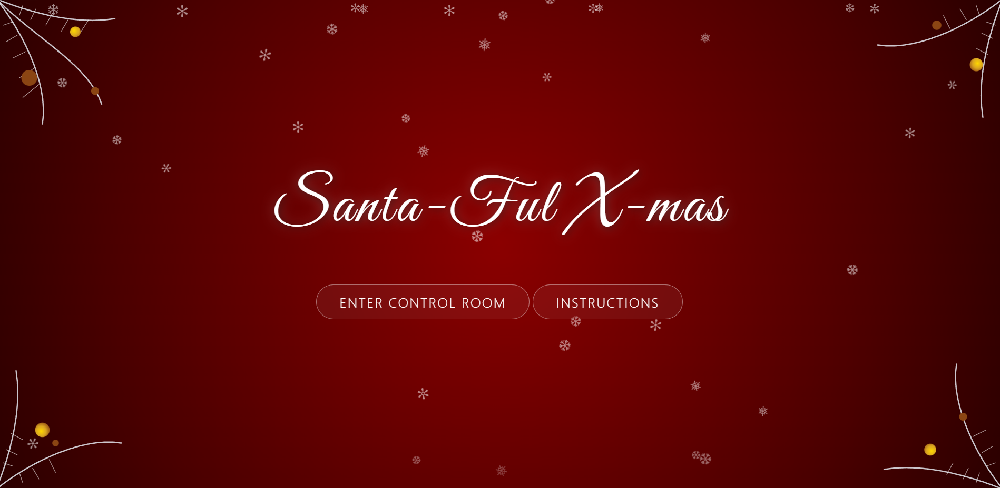
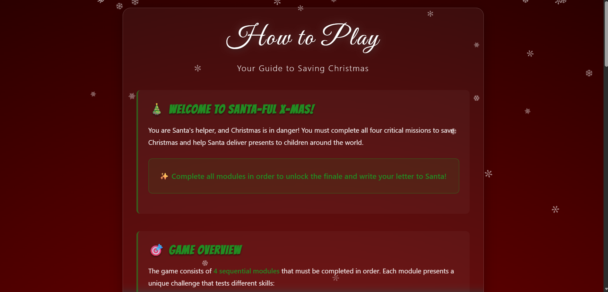
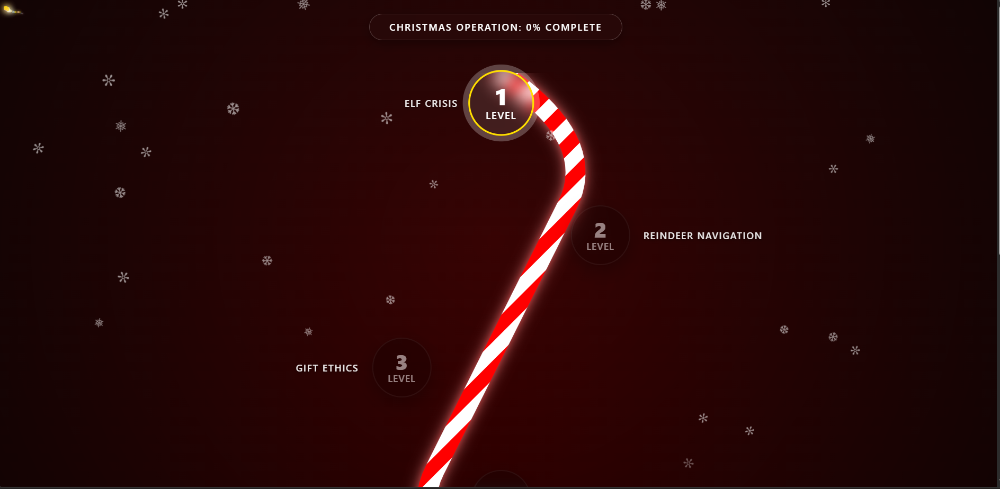
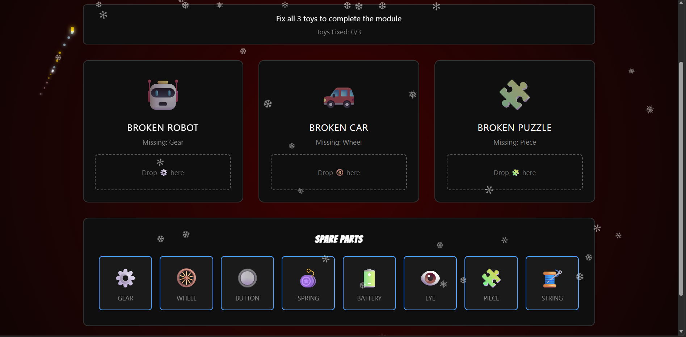
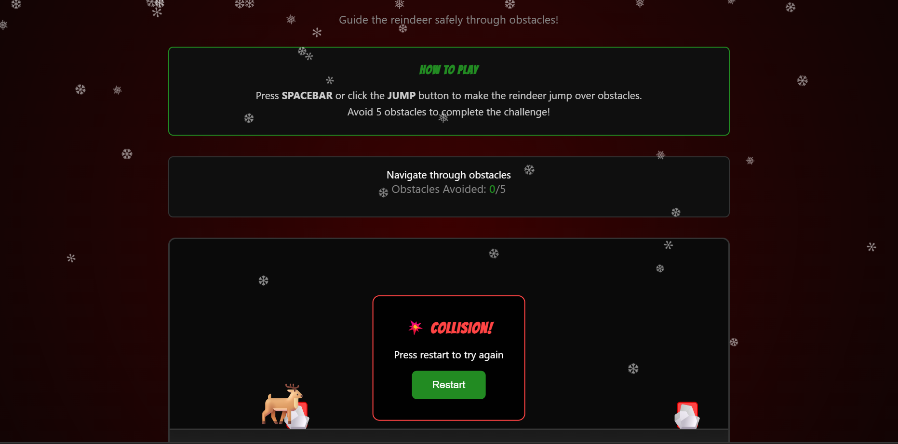
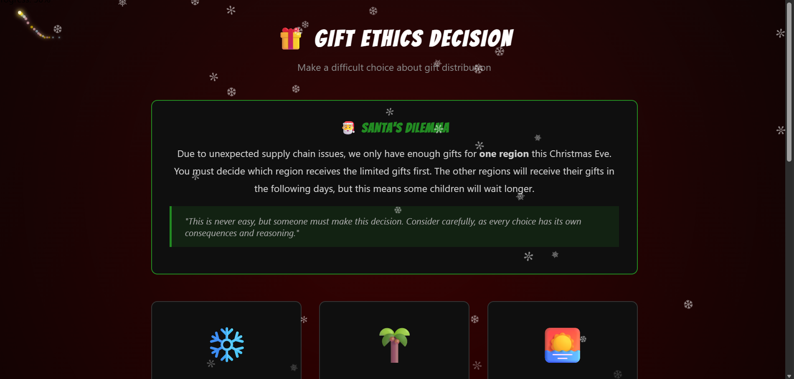
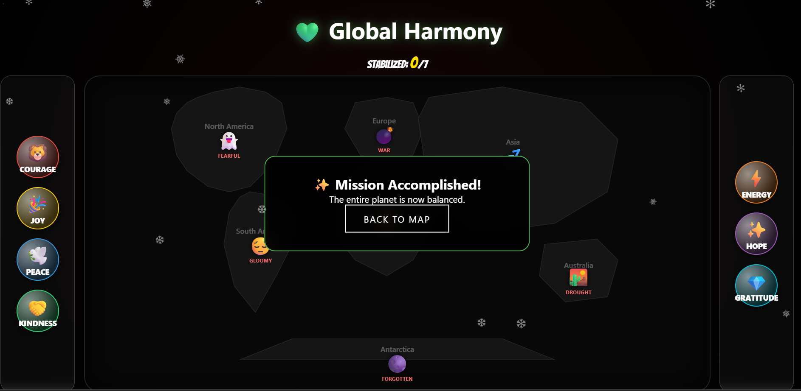
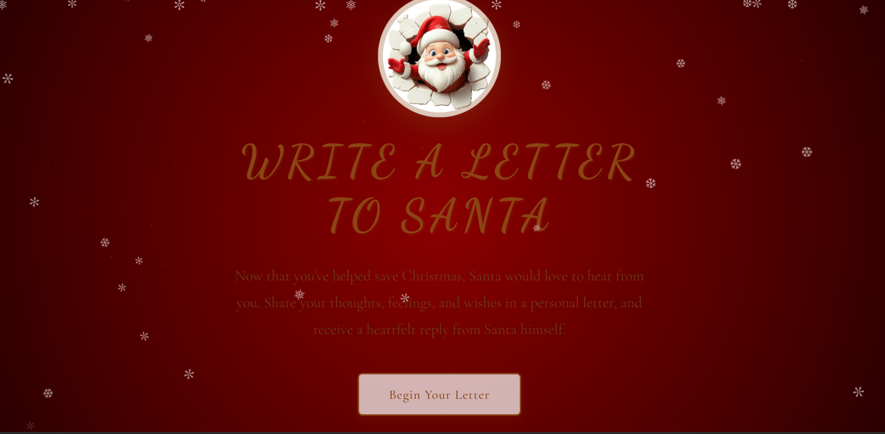
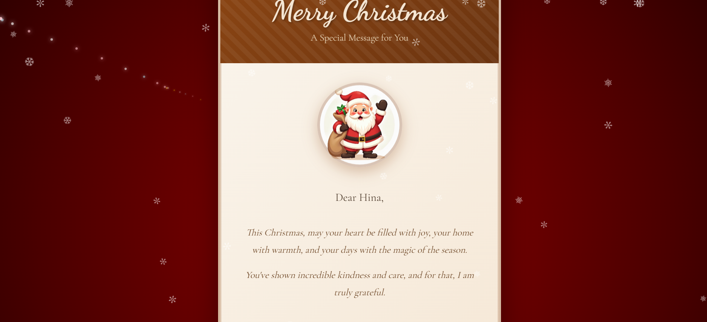

# 🎅 Santa-ful X-mas - Interactive Christmas Adventure

An immersive, interactive web application that takes users on a magical Christmas journey. Help Santa complete his mission by solving challenges across 4 unique game modules, then receive a personalized letter from Santa himself!

## 📖 Project Description

Santa-ful X-mas is a Christmas-themed interactive web experience where users become Santa's helpers. The application features a sequential game progression system where players must complete 4 modules in order:

1. **Elf Crisis** - Fix broken toys before Christmas
2. **Reindeer Navigation** - Guide Santa's reindeer through obstacles
3. **Gift Ethics** - Make important decisions about gift distribution
4. **Emotion Stabilizer** - Spread joy and happiness across the world

Upon completing all modules, players unlock the special "Letter to Santa" feature, where they can write a personalized letter and receive an AI-generated, emotionally-aware response from Santa. The app includes beautiful animations, background music, text-to-speech functionality, and a stunning finale celebration.

## ✨ Features

### 🎮 Game Modules
- **Sequential Unlocking System**: Modules unlock progressively as you complete each challenge
- **Progress Tracking**: Visual progress bar showing completion percentage
- **Interactive Map**: Beautiful journey visualization with a candy cane path connecting all modules
- **Module Completion Rewards**: Celebrate achievements with visual feedback

### 📝 Letter to Santa
- **Personalized Letter Writing**: Submit your Christmas wishes, feelings, and memories
- **AI-Generated Santa Replies**: Receive emotionally-aware, personalized responses from Santa
- **Text-to-Speech**: Hear Santa read your letter aloud (stops automatically when navigating away)
- **Christmas Card Generation**: Get a beautiful, personalized Christmas card

### 🎨 User Experience
- **Beautiful UI/UX**: Modern, responsive design with Christmas-themed aesthetics
- **Background Music**: Immersive audio experience throughout the journey
- **Smooth Animations**: Engaging transitions and visual effects
- **Responsive Design**: Works seamlessly on desktop and mobile devices
- **Session Management**: Progress is saved in browser sessions

### 🎯 Additional Features
- **Instructions Page**: Comprehensive guide on how to play
- **Finale Celebration**: Special completion page with confetti and animations
- **Reset Functionality**: Start your journey over anytime
- **Character Messages**: Encouraging messages from Santa, elves, and reindeer

## 🛠️ Tech Stack

### Backend
- **Flask 3.0.0** - Python web framework for routing and session management
- **Python 3.x** - Core programming language

### Frontend
- **HTML5** - Structure and semantic markup
- **CSS3** - Styling with modern features (gradients, animations, flexbox)
- **JavaScript (ES6+)** - Interactive functionality and DOM manipulation
- **Web Speech API** - Text-to-speech for letter reading

### Key Technologies
- **Jinja2 Templates** - Server-side templating engine (included with Flask)
- **Session Management** - Flask sessions for progress tracking
- **Responsive CSS** - Mobile-first design approach
- **CSS Animations** - Smooth transitions and visual effects

## 🚀 Setup Instructions

### Prerequisites
- Python 3.7 or higher
- pip (Python package installer)
- A modern web browser (Chrome, Firefox, Edge, Safari)

### Installation Steps

1. **Clone or download the repository**
   ```bash
   cd project_directory
   ```

2. **Create a virtual environment (recommended)**
   ```bash
   # On Windows
   python -m venv xvenv
   xvenv\Scripts\activate

   # On macOS/Linux
   python3 -m venv venv
   source venv/bin/activate
   ```

3. **Install dependencies**
   ```bash
   pip install -r requirements.txt
   ```

4. **Run the application**
   ```bash
   python app.py
   ```

5. **Open your browser**
   - Navigate to `http://127.0.0.1:5000` or `http://localhost:5000`
   - The app should now be running!

### Configuration

- **Secret Key**: For production, change the `app.secret_key` in `app.py` to a secure random string
- **Debug Mode**: The app runs in debug mode by default. Disable for production

### Project Structure
```
Santa_app/
├── app.py                      # Main Flask application
├── requirements.txt            # Python dependencies
├── modules/                    # Application modules
│   ├── letter_logic.py        # Letter session management
│   └── santa_reply_generator.py # AI reply generation
├── templates/                  # HTML templates
│   ├── base.html              # Base template
│   ├── index.html             # Landing page
│   ├── instructions.html      # Game instructions
│   ├── map.html               # Journey map
│   ├── elf_module.html        # Elf Crisis game
│   ├── reindeer_module.html   # Reindeer Navigation game
│   ├── ethics_module.html     # Gift Ethics game
│   ├── emotion_module.html    # Emotion Stabilizer game
│   ├── finale.html            # Completion page
│   ├── letter_intro.html      # Letter introduction
│   ├── letter_form.html       # Letter writing form
│   ├── santa_reply.html       # Santa's reply page
│   └── christmas_card.html    # Christmas card
├── static/                     # Static assets
│   ├── assets/
│   │   ├── audio/             # Background music
│   │   └── images/             # Images and graphics
│   ├── style.css              # Global styles
│   └── script.js              # Global JavaScript
└── README.md                   # This file
```

## 📸 Screenshots

### Landing Page


### Instructions


### Journey Map / Levels


### Game Modules

#### Elf Crisis Module


#### Reindeer Navigation Module


#### Gift Ethics Module


#### Emotion Stabilizer Module


### Letter to Santa


### Christmas Card


## 🎯 How to Play

1. **Start Your Journey**: Click "Enter" on the landing page
2. **Read Instructions**: Familiarize yourself with the game mechanics
3. **Complete Modules**: Work through each module sequentially:
   - Complete Module 1 to unlock Module 2
   - Complete Module 2 to unlock Module 3
   - And so on...
4. **Track Progress**: Watch your progress bar fill as you complete modules
5. **Write to Santa**: After completing all 4 modules, unlock the letter feature
6. **Receive Your Reply**: Get a personalized response from Santa
7. **Celebrate**: Enjoy your Christmas card and finale celebration!

## 🔧 Development Notes

- The app uses Flask sessions to track progress (no database required)
- All game state is stored in browser sessions
- Text-to-speech uses the browser's Web Speech API
- Background music plays automatically on supported pages
- The app is designed to work offline after initial load (except for external fonts)

## 📝 License

This project is created for educational and entertainment purposes.

## 🤝 Contributing

Feel free to fork this project and make it your own! Suggestions and improvements are welcome.

## 🎄 Merry Christmas!

Enjoy your journey with Santa! 🎅🎁❄️

